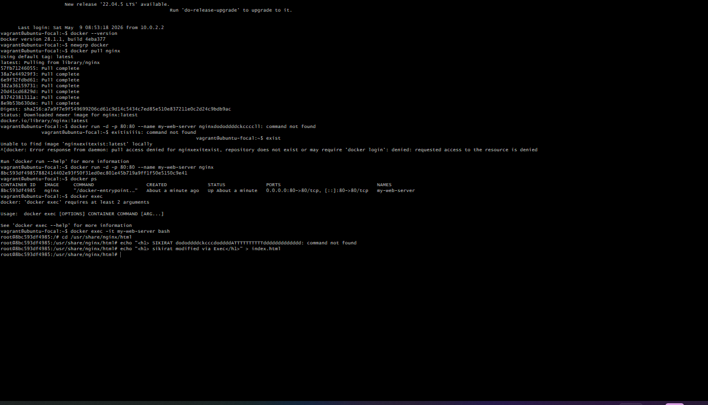
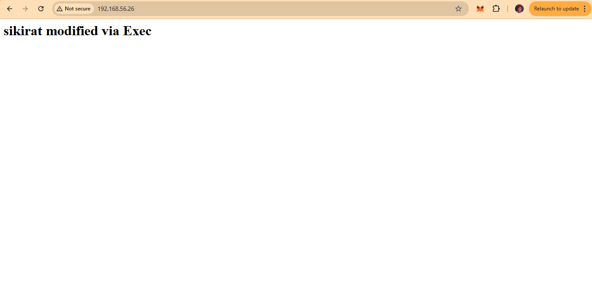
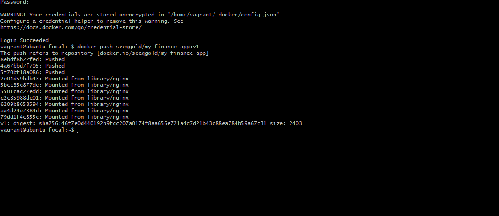
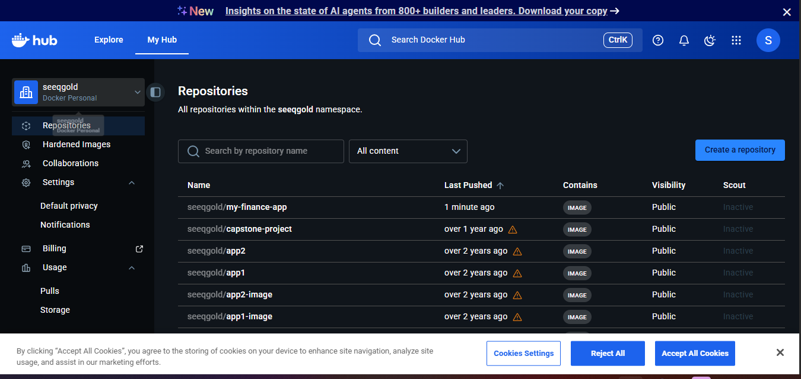

# dockerized-nginx-finance-app
A Dockerized Nginx web application built using a finance website template.
# Dockerized Nginx Finance App

## Project Overview
This project demonstrates how to containerize a static web application using Docker and Nginx. A finance website template was customized, packaged into a Docker image, and pushed to Docker Hub.

The project covers:
- Docker installation and setup
- Pulling Docker images from Docker Hub
- Running and managing containers
- Editing Nginx content inside a container
- Creating a Dockerfile
- Building custom Docker images
- Pushing Docker images to Docker Hub

---

## Technologies Used
- Docker
- Nginx
- Ubuntu
- Vagrant
- VirtualBox

---
##images






------------

## Project Structure

```bash
.
├── Dockerfile
├── index.html
├── css/
├── js/
├── images/
└── README.md

